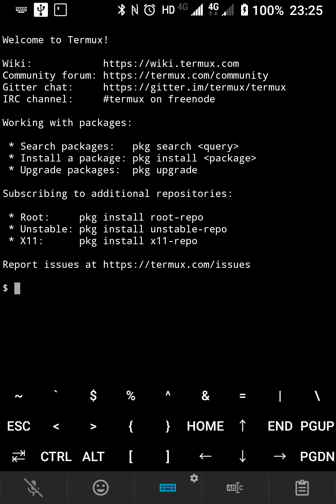
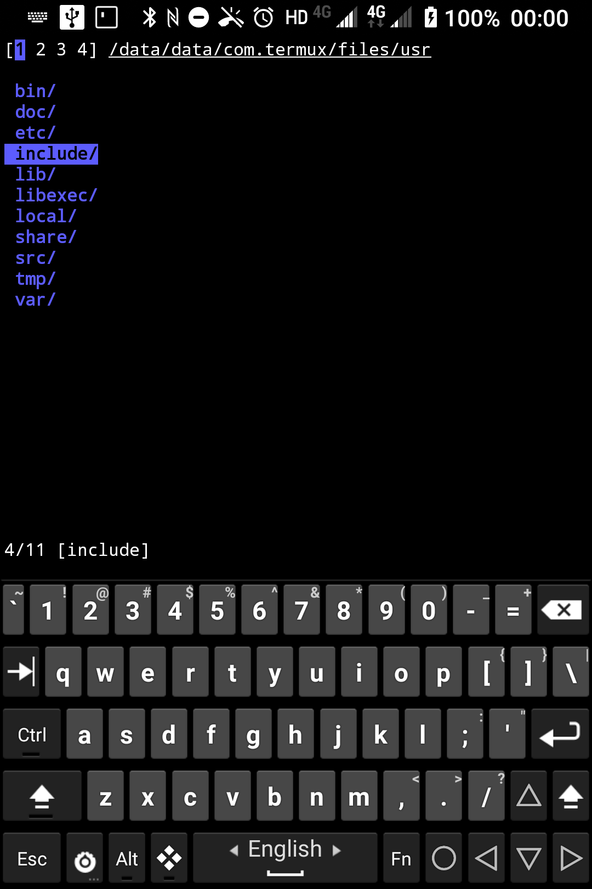
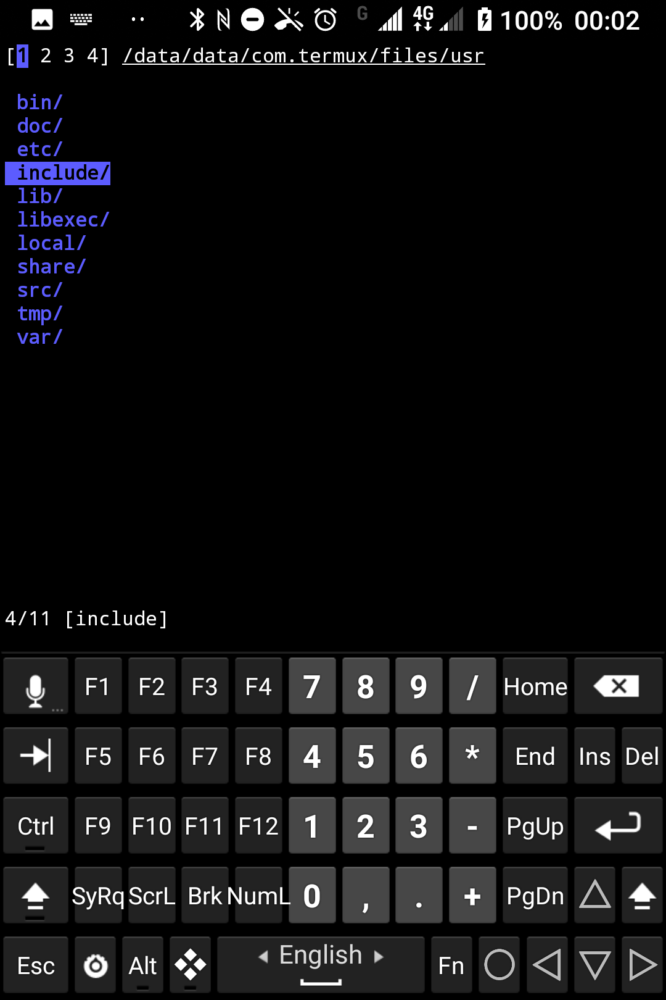
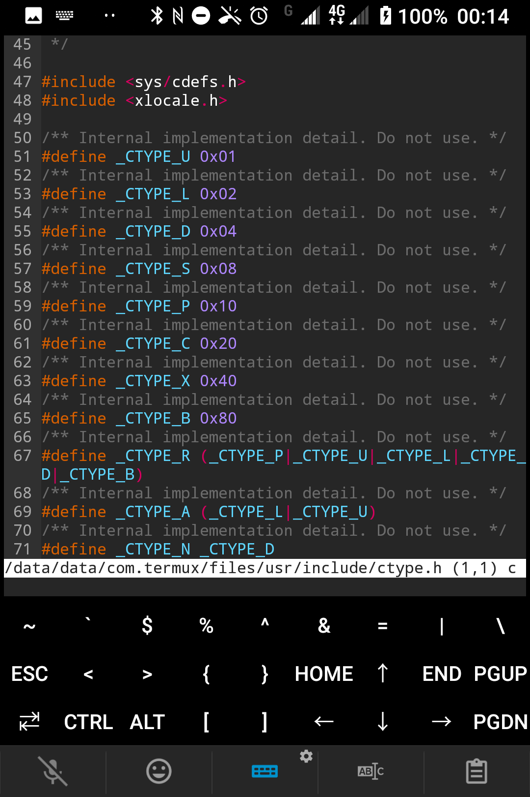
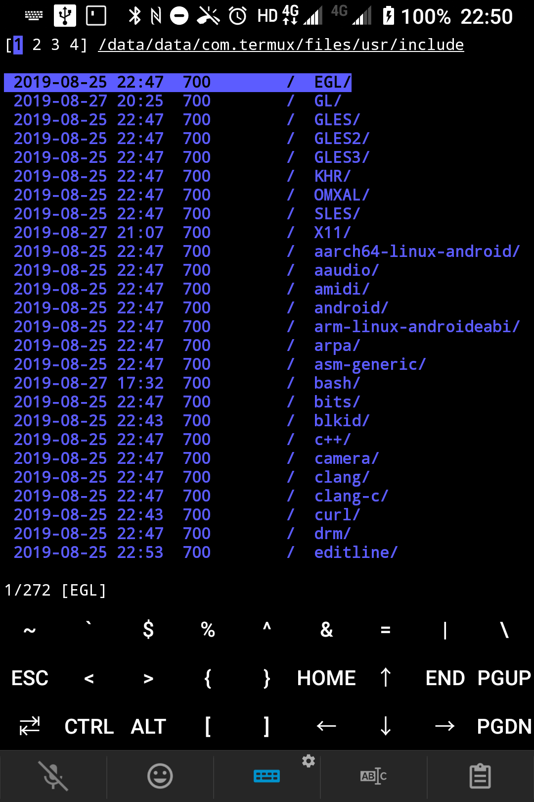
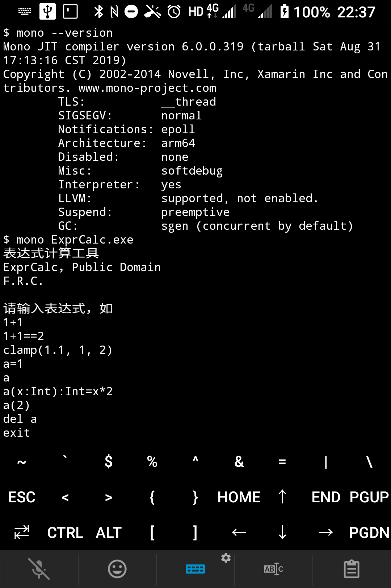
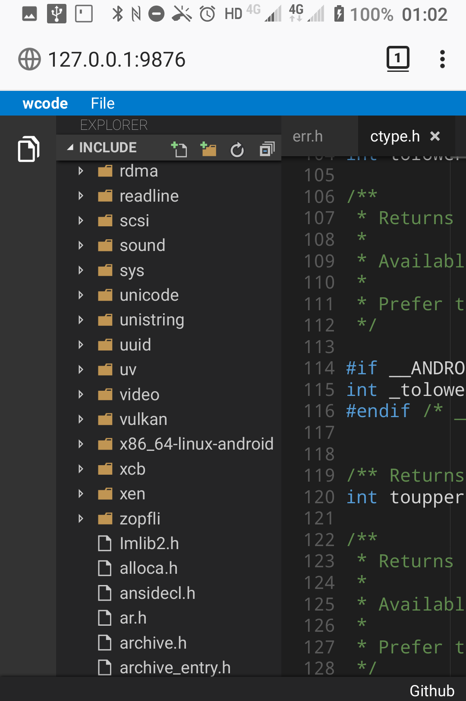
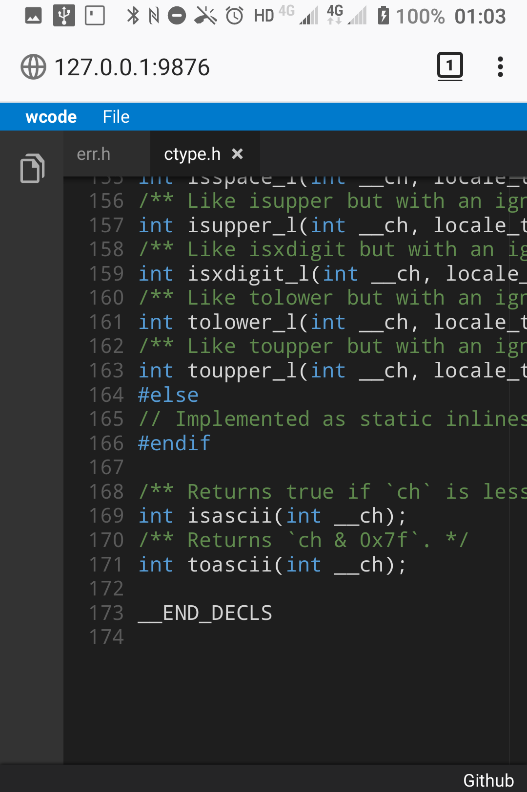

# 使用Android手机进行开发的尝试

Ianus Inferus

2019-09-02

使用Android手机查看和修改Excel文件、PowerPoint文件并连接幻灯机进行演示等办公方式想必大家已经有所了解。今天介绍一下怎样使用Android进行软件开发。

## Termux

使用Android进行软件开发最重要的工具是命令行终端。[Termux](https://github.com/termux/termux-app)就是其中功能最丰富、生态最好的命令行终端。

Termux可以通过F-Droid直接下载apk文件进行安装，或从Google Play Store下载。

Termux附带包管理器，能够下载常见的Linux命令行工具，如openssh, wget, curl, git, clang, ninja等。

    pkg install openssh wget curl git clang ninja

## Hacker's Keyboard

有了命令行，就能输入命令了，但是好像输入法没有上下左右键、没有Ctrl键，输入命令很不方便。这个时候可以安装[Hacker's Keyboard](https://github.com/klausw/hackerskeyboard)输入法。这个输入法包含PC键盘上的所有按键。

如果大家使用的手机正好是和笔者的BlackBerry Key²一样拥有实体键盘，可以通过修改~/.termux/termux.properties文件，在Termux中增加缺少的符号。详细参考[这里](https://wiki.termux.com/wiki/Touch_Keyboard)。

    extra-keys = [ \
    ['~','`','$','%','^','&','=','|','BACKSLASH'], \
    ['ESC','<','>', '{', '}','HOME','UP','END','PGUP'], \
    ['TAB','CTRL','ALT', '[', ']','LEFT','DOWN','RIGHT','PGDN']]

## OpenSSH

OpenSSH是Termux中必装软件，安装之后可以启动SSH服务器，并通过SSH客户端如PuTTY远程控制手机，并能通过SCP客户端如WinSCP访问手机上的Termux内部数据和SD卡目录。还能从手机远程连接其他开启SSH服务器的设备。

安装之后，运行sshd即可。登录需要在~/.ssh/authorized_keys中和通常的Linux一样配置公钥。

Termux可以通过[Termux:Widget](https://wiki.termux.com/wiki/Termux:Widget)来将一些用户自定义的命令行操作变成Android Widget放在桌面上方便点击执行。sshd应该是必备的条目。

## micro

Termux中自带的文本编辑器为vi。如果你对vim和emacs不熟悉，[micro](https://github.com/zyedidia/micro)是一个优良的命令行文本编辑器。安装方法如下：

    pkg install micro

使用方法非常简单，手指点击即可将光标移动到指定位置，Ctrl+S保存，Ctrl+Q退出，Alt+G显示常用命令，Ctrl+G显示帮助。

需要注意的是，默认模式下是不会软换行的。另外就是输入'"([等字符会自动输入配对的符号。建议修改这些配置。修改地址为~/.config/micro/settings.json，可以修改下列对应行的内容：

    "autoclose": false,
    "softwrap": true,

此外，在SSH连接时micro默认无法复制粘贴，因为光标被micro占用。此时可以按住Shift键再进行复制粘贴，如在PuTTY中按住Shift键鼠标选择复制，按住Shift键鼠标右键粘贴。

## nnn

[nnn](https://github.com/jarun/nnn)是Termux上的命令行文件管理器，可用于进行快速文件夹跳转。

安装方式

    pkg install nnn

常见的操作包括上下箭头切换光标，左箭头进入上级文件夹，右箭头或回车进入当前光标所在文件夹或打开文件，Q退出，Ctrl+G退出并进入到当前文件夹。注意Ctrl+G的功能需要[配置](https://github.com/jarun/nnn/wiki/Basic-use-cases#configure-cd-on-quit)。需要在~/.bash_profile中加入如下函数：

    n()
    {
        export NNN_TMPFILE=${XDG_CONFIG_HOME:-$HOME/.config}/nnn/.lastd

        nnn "$@"

        if [ -f $NNN_TMPFILE ]; then
                . $NNN_TMPFILE
                rm -f $NNN_TMPFILE > /dev/null
                pwd >&2
        fi
    }

## Termux:API

[Termux:API](https://wiki.termux.com/wiki/Termux:API)可以实现一些Android功能的自动化，但其中最重要的功能是在PC和Android设备之间进行剪贴板的同步。

安装方式：先下载apk安装之后再在Termux中运行

    pkg install termux-api

通过SSH执行下面的命令可以在终端显示Android剪贴板的内容

    termux-clipboard-get

通过SSH执行下面的命令可以将指定内容设置到Android剪贴板上

    termux-clipboard-set <内容>

## clang

[clang](https://llvm.org/)的使用方式和正常一样。Termux不支持gcc，一般都使用clang进行编译。需要注意的是Termux中的系统libc++库不支持静态库，只支持动态库，标准C库为Bionic。虽然使用跨平台编译器和musl libc也能编译出能够在Termux上运行的程序，但是存在一些[问题](https://github.com/xeffyr/termux-stuff/tree/master/musl-libc-packages)。Termux不支持glibc。

安装方式

    pkg install clang llvm lld

## Mono

[mono](https://www.mono-project.com/)没有包支持。但是有社区版本，如笔者编译的[termux-mono](https://github.com/IanusInferus/termux-mono)以及一些在PRoot运行的Arch Linux和Ubuntu中运行的版本。以下为termux-mono最新版本，不需要PRoot即可直接运行。

## Android App开发

虽然Termux中没有JDK, Android SDK和Android NDK，但是仍然可以进行Android App开发。其中JDK可以使用ecj代替，Android SDK可以使用独立的dx, aapt和apksigner代替，Android NDK可以使用clang代替。使用这些软件通过调用命令行就能生成.so文件, .dex文件和.apk文件。

安装方式

    pkg install ecj dx aapt apksigner

需要注意的是，Android SDK API 28引入的d8现在还[不支持](https://github.com/termux/termux-packages/tree/master/disabled-packages/d8)，所以编译Java 8和之后版本的代码会比较困难。

## Wcode

Termux内部查看和编辑代码不方便；Termux中的文件无法被外部的App所查看和编辑；SDCard模拟分区通常是FAT32格式的不支持执行权限，代码放在其中非常不方便。

于是有人想到通过在Termux中运行一个服务器，然后在外部连接服务器进行文件编辑的[方法](https://medium.com/samsung-internet-dev/writing-software-using-a-phone-e71976f1f18d)。为了实现类似于Visual Studio Code的编辑体验，他直接使用了Visual Studio Code的[Monaco Editor](https://github.com/microsoft/monaco-editor)，在Termux中通过nodejs运行一个HTTP服务器，并在浏览器中进行访问。他的代码在[这里](https://github.com/SamsungInternet/web-code)。但是效果比较差，只适合在平板上运行。

后面又有人又做了一个类似的程序，就是[Wcode](https://github.com/fmsouza/wcode)。

安装方式

    pkg install nodejs
    npm install -g wcode

笔者对Wcode进行了一些[修改](https://github.com/IanusInferus/wcode)，修正了一些bug，并使其在手机上能更好地运行。

## 快捷输入

很多常用命令很长，输入不变，可以通过bash alias来进行简记。

打开~/.bash_profile，即可增加alias指令。笔者的alias指令如下：

    alias cg=termux-clipboard-get
    alias cs=termux-clipboard-set
    alias m=micro
    alias i='ifconfig | grep '\''inet '\'' | sed '\''s/ *inet//g'\'' | cut -d'\'' '\'' -f2'
    alias p='ping www.bing.com'
    alias w=wcode

其中i为显示当前IP地址。

之后退出Termux再进入，即可通过简短命令来运行程序了。
