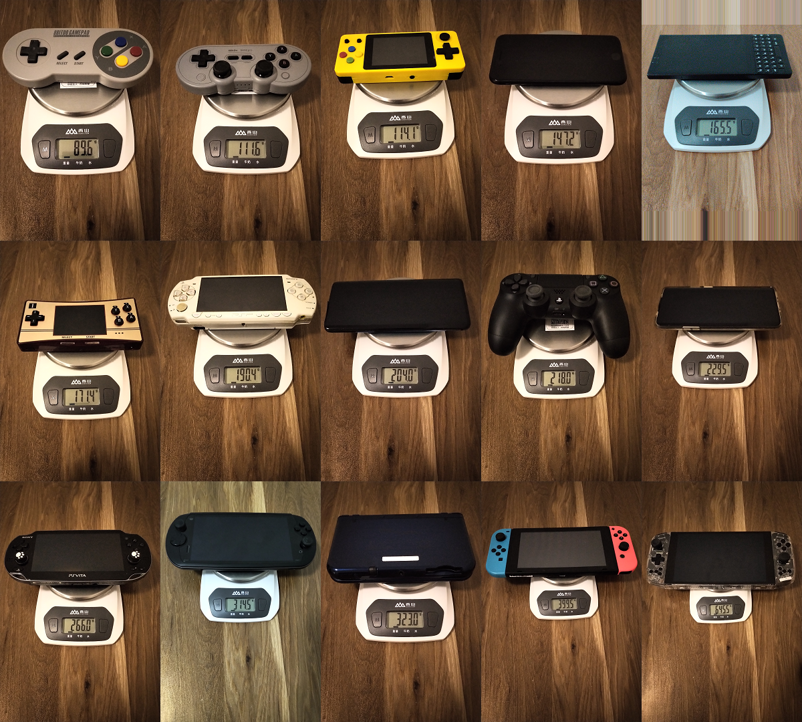

# 掌机的重量和屏幕

Ianus Inferus

2021-10-04

最近翻出了PSV和PSP玩一些老游戏，又买了微雪的GPM2804掌机来玩SFC和PS的游戏。考虑到躺着的时候玩游戏对掌机重量要求很高，而网上的数据有时候很难确定是否准确，便决定买一个天平自行测量一下。又想到之前买过一个放大镜，就顺便也测试一下屏幕的像素排布。

作为参考，以下数据中包含一些手机和手柄。

## 重量

| 设备               | 重量   |
| ------------------ | ------ |
| 八位堂SF30         |  89.6g |
| 八位堂SN30Pro      | 111.6g |
| 小龙王横板         | 114.1g |
| iPhoneSE2020       | 147.2g |
| BlackBerryKey2     | 165.5g |
| GPM2804            | 171.4g |
| PSP2000(无UMD盘)   | 190.4g |
| OnePlus7TPro       | 204.0g |
| DS4                | 218.0g |
| OnePlus7TPro(带壳) | 229.5g |
| PSV1000            | 266.0g |
| 摩奇i7s            | 314.5g |
| new3DSLL           | 323.0g |
| Switch续航版       | 399.5g |
| AyaNeo创始人版     | 645.5g |

## 屏幕

| 设备            | 面板              | 物理尺寸         | 像素大小         | 像素排列    | 方向     | 等效像素密度(PPI) |
| --------------- | ----------------- | ---------------- | ---------------- | ----------- | -------- | ----------------- |
| 小龙王横板      | 不明LCD           | 2.6英寸          | 320x240          | Delta排列   | 竖屏旋转 | 107.7(系数取0.7)  |
| new3DSLL(上屏)  | IPS(有些机器为TN) | 4.88英寸         | 400x240(800x240) | RGB排列     | 竖屏旋转 |  95.6             |
| new3DSLL(下屏)  | TN(有些机器为IPS) | 4.18英寸         | 320x240          | RGB排列     | 竖屏旋转 |  95.7             |
| PSP2000         | TN                | 4.3英寸          | 480x272          | RGB排列     | 横屏     | 128.3             |
| GPM2804         | IPS               | 2.8英寸          | 640x480          | RGB排列     | 竖屏旋转 | 285.7             |
| PSV1000         | OLED              | 4.9英寸          | 960x544          | RGB排列     | 横屏     | 225.2             |
| Switch续航版    | IPS               | 6.2英寸          | 1280x720         | RGB排列     | 竖屏旋转 | 236.9             |
| iPhoneSE2020    | IPS               | 4.7英寸          | 750x1334         | RGB排列     | 竖屏     | 325.6             |
| AyaNeo创始人版  | IPS               | 7英寸            | 1280x800         | RGB排列     | 竖屏旋转 | 215.6             |
| BlackBerryKey2  | IPS               | 4.5英寸          | 1620x1080        | RGB排列     | 竖屏     | 432.7             |
| 摩奇i7s         | IPS               | 6英寸            | 1920x1080        | RGB排列     | 竖屏旋转 | 367.2             |
| OnePlus7TPro    | OLED              | 6.67英寸         | 1440x3120        | Pentile排列 | 竖屏     | 412.1(系数取0.8)  |

以下使用BlackBerryKey2和放大镜拍摄。

以下使用OnePlus7TPro和放大镜拍摄。

## 结论

GPM2804掌机的重量控制不错，比PSP2000轻，躺在床上玩起来也不累，像素密度在Switch续航版和iPhoneSE2020之间，像素排列正常，从像素密度和像素排列上都比小龙王横板好很多。

除索尼的设备为原生横屏外，其他被测设备均为竖屏或竖屏旋转为横屏。
