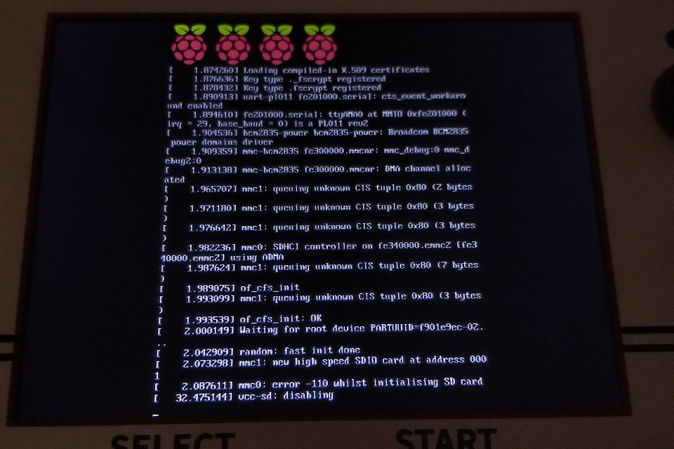
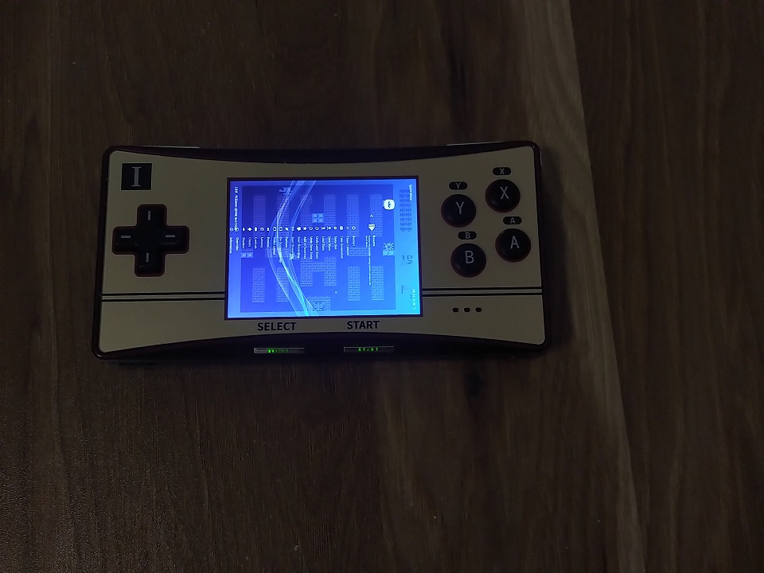

# 微雪GPM2804掌机使用感想

Ianus Inferus

2021-10-11

买微雪的[GPM2804](https://www.waveshare.net/wiki/GPM2804)掌机有一段时间了，这里说下感想。

## 硬件

外壳看上去很高级，但手持时容易出汗，产生一种特殊的油腻感。

重量轻，仅171.4g。

屏幕为2.8英寸IPS屏幕，640x480，RGB排列，竖屏旋转，像素密度(PPI)为285.7。亮度调节方法为按住L键时按音量加减。

重量和屏幕的对比可以参考我之前的博客[掌机的重量和屏幕](20211004_handhelds.html)。

声音只有单喇叭<del>且音量较小</del>，有3.5mm耳机孔<del>，用耳机会比较好</del>。如果配置不对可能声音较小。

<del>MicroUSB无法连接键盘等外设，似乎只能供电。主板上三个开关的功能似乎分别控制是否使用USB接口、SD卡、按键。需要额外的IO板才能刷写eMMC(如果CM4带eMMC)或更换EEPROM固件。</del>主板上有三个开关：S1 S2 S3全部设置为1，为正常模式；S1 S2 S3全部设置为0，为eMMC烧写模式，应该可以进行eMMC和EEPROM固件的烧写；S1设置为0，S2设置为1，S3设置为0，为USB外设模式，此时USB供电和自带手柄失效，可以连接键盘、U盘或网卡等。连接USB千兆网卡，最大速度为300Mbps左右。

没有视频输出功能。

WiFi为Raspberry Pi CM4核心板上搭载，支持802.11ac (2.4GHz和5.8GHz)，可以正常连2.4GHz，但默认5.8GHz兼容性差。解决方法见软件部分。5.8GHz使用iperf3测速，最大速度为100Mbps左右，传输文件达不到此速度，应该MicroSD卡有拖慢。传大游戏最佳方式为将MicroSD卡直接挂载到Linux机器上写入，实测SanDisk的32GB(Ultra)可以达到80MB/s，不过要注意文件的用户和组默认为Linux机器的，会导致无法存档，在Pi上转到文件夹，并使用`sudo chown -R pi:pi .`将文件夹的用户和用户组都改为pi即可。

蓝牙和WiFi集成在同一个芯片上，可以连接八位堂SN30Pro手柄和蓝牙键盘(退出到shell仍然可用)，不支持Bose QuietControl 30耳机(可能是软件问题)。

MicroSD卡插槽和外壳之间有空隙，容易把MicroSD卡插到机器内部去，需要拆开外壳拿出。MicroSD卡启动在我的机器上不兼容SanDisk的32GB(Ultra)和64GB(Extreme)。安装RetroPie后开机一直显示黑屏并在最上方闪烁光标，在`/boot/cmdline.txt`中移除所有的quiet，加上debug之后，提示`mmc0: error -110 whilst initialising SD card`，尝试了更换EEPROM固件(pieeprom-2021-02-16.bin、pieeprom-2021-07-06.bin、pieeprom-2021-10-05.bin，参考[RaspberryPie EEPROM固件](https://github.com/raspberrypi/rpi-eeprom/tree/master/firmware))也没有什么作用，但相同的CM4和MicroSD卡放到另外一个IO板上却可以正常启动(`config.txt`和`cmdline.txt`略有差异)。<del>我听说有其他机器可以正常使用SanDisk的MicroSD卡，可能我遇到的这个问题为个案。另外我使用的CM4为带WiFi不带eMMC内存4GB的CM4-Lite，而完整版机器自带的为带WiFi不带eMMC内存1GB的CM4-Lite，略有差异，不知道有没有关系。</del>目前已确认有多台机器遇到此问题，且不限于SanDisk的卡，三星、Lexar的卡都有遇到问题。容量似乎没有关系，已有256GB的无牌MicroSD卡可以正常使用。主要和生产时间相关，建议使用带⑩标记、不带A1、A2标记的卡，带A1标记、不带A2标记的可以尝试。出厂自带的MicroSD卡为川宇的卡，目前看均为带⑩标记、不带A1、A2标记。后来我的机器返厂进行了维修，维修之后可以正常使用SanDisk的MicroSD卡了，且很快就修好了，没有修改镜像，硬件也没有明显部件变化，感觉可能是硬件焊接问题。

电池大小为3.7V 3500mAh，续航比上一代产品GPM2803强，我玩了一下午3～4个小时才没电。

## 软件

当前适配的系统为RetroPie，菜单为EmulationStation，模拟器前端为RetroArch。

由于屏幕是竖屏旋转而来，而Raspberry Pi 4不再支持display_rotate启动选项，且RetroArch菜单无法配置旋转，导致菜单会旋转90度，目前暂无解决方法，需要在RetroArch上适配。另外RetroArch的内核中，非RetroArch/Libretro官方支持内核(不带lr前缀的)也会旋转90度。

以太网驱动可能有[问题](https://raspberrypi.stackexchange.com/questions/117297/apt-update-results-in-hash-sum-mismatch)。

WiFi 5.8GHz兼容性差是驱动问题(在`wpa_supplicant.conf`中将区域设置为CN后，输入`iw phy phy0 channels`可以发现36-48、52-64等可用信道被禁用，部分解决方法参考 [这里](https://github.com/raspberrypi/firmware/issues/1359) [这里](https://www.raspberrypi.org/forums/viewtopic.php?f=117&t=291609)，方法为使用下载的`brcmfmac43455-sdio.clm_blob`文件替换`/lib/firmware/brcm/`下的同名文件)。

闲置时缺乏睡眠机制，只能在主菜单按Select键息屏，但仍然会发热。

进入shell的方法有通过WiFi进行ssh和通过蓝牙键盘配对直接操作两种，但是都存在搞坏系统后无法通过U盘和USB键盘启动系统需要将MicroSD卡拿到另外的Linux机器上挂载修复的问题。

无法从屏幕或者命令行获得电池电量，只能通过下方SELECT、START键的灯来观察，分为绿灯、蓝灯、红灯三档，充电时灯会闪烁。

尝试在4GB内存的CM4-Lite上安装[Windows on Raspberry Pi](https://www.worproject.ml/)，点亮屏幕后无显示，而在另外一个IO板上可以正常启动，怀疑是由于屏幕分辨率没有适配的原因(屏幕分辨率因为竖屏旋转的关系，实际上是480x640，而Windows on Raspberry Pi的配置中只有似乎640x480等正常分辨率和Native Resolution可选择)。

## 游戏

SFC测试了耀西岛，可以流畅运行，声音正常，说明性能达标，应该大部分游戏都正常。

PS测试了FF9，可以流畅运行。多碟游戏可以使用m3u文件包含ccd文件来进行游戏。

## 文件系统

官方镜像中有两个分区，其中第一个为fat16的boot分区，挂载到/boot，第二个为ext4的主分区，挂载到/。

ext4分区可以挂载到Linux机器上进行修改。如果使用USB的SD卡适配器，可以在机器上执行`ls /dev/sd*`找到对应的分区名称(例如`/dev/sdb2`，一般为不是Linux机器本身硬盘的新盘的第二个分区)。

找到分区后，首先创建一个空文件夹，例如`/mnt/sdcard`，然后可以使用类似`sudo mount /dev/sdb2 /mnt/sdcard`的命令即可将分区挂载上去，再使用`sudo umount /dev/sdb2`即可卸载。

官方镜像的ext4分区有一些文件系统错误，可以在分区卸载状态下使用`fsck`命令进行修复，需要使用`-f`选项进行强制修复，可以使用`-y`选项对所有问题均选择yes。

## 增加exfat分区

前面提到最快的拷游戏方法为直接在PC上读写MicroSD卡，但默认的分区格式为ext4的，在Windows读写非常不方便。这个问题我们可以通过减小原来的分区大小，并新增一个exfat分区来解决。

需要一台安装好Linux系统的PC，并且有读卡器或者MicroSD转USB适配器。以下操作均在该PC上完成。

切换到管理员状态

    sudo -s

查找MicroSD卡的分区名称

    lsblk

挂载，这里和后面的/dev/sdb2需要替换为机器上的分区名称

    mkdir -p /mnt/sdcard
    mount /dev/sdb2 /mnt/sdcard

将系统复制到本地硬盘的临时文件夹(由于Linux下缩减分区时存在各种磁盘碎片影响，最简单的办法是将数据移动到其他分区再移回来)

    cp -rTfp /mnt/sdcard /tmp/tree

将游戏移动到本地硬盘的临时文件夹

    mkdir -p /tmp/roms
    mv /tmp/tree/home/pi/RetroPie/roms/* /tmp/roms/

获取系统中数据的总大小

    du -sh /tmp/tree

卸载MicroSD卡

    umount /mnt/sdcard

输出各分区大小

    parted /dev/sdb unit B print

修改分区大小，第一个参数2表示/dev/sdb2的2，第二个参数表示分区结束位置+1，需要超过第二个分区的起始位置与文件系统大小之和

    parted /dev/sdb resizepart 2 4567597056B

将分区写0，便于制作镜像，结束时会显示`dd: error writing '/dev/sdb2': No space left on device`，这是正常的

    dd if=/dev/zero of=/dev/sdb2 bs=1M

重新创建文件格式

    mkfs.ext4 /dev/sdb2

输出剩余空间大小

    parted /dev/sdb unit B print free

使用剩余空间创建新分区，起始需要为1MB(1024*1024)的整数倍

    parted /dev/sdb mkpart primary ext4 4568645632B 100%

或者如果要创建只有32MB的小分区，可以用下面的命令

    parted /dev/sdb mkpart primary ext4 4568645632B 4602200064B

新分区格式化为exfat，可能需要先用包管理工具安装exfat工具，例如exfat-utils fuse-exfat(或者exfat-fuse)

    mkfs.exfat /dev/sdb3

挂载系统分区

    mount /dev/sdb2 /mnt/sdcard

将原有数据拷回

    cp -rTfp /tmp/tree /mnt/sdcard

修改/etc/fstab文件

    nano /mnt/sdcard/etc/fstab

增加，如果不为微雪官方镜像需要手工对照已有的项修改PARTUUID

    PARTUUID=cad35142-03  /home/pi/RetroPie/roms exfat noatime,uid=pi,gid=pi 0 3

卸载分区

    umount /mnt/sdcard

挂载游戏分区

    mount /dev/sdb3 /mnt/sdcard

获取临时文件夹中的数据的总大小，如果有超过，可以删除一些

    du -sh /mnt/sdcard

将游戏拷贝到MicroSD卡上，微雪官方镜像中存在genesis软链接到megadrive文件夹，由于exfat不支持会消失，可以自行创建并放入游戏

    cp -rTf /tmp/roms /mnt/sdcard

卸载分区

    umount /mnt/sdcard

MicroSD卡在Windows上新分区可能会显示成隐藏的，使用DiskGenius取消隐藏并分配盘符即可使用。

完成后将MicroSD卡取下放到掌机中即可。

文件系统的扩展和收缩也可以使用`resize2fs`配合`parted resizepart`完成，但是由于无法把数据都搬到分区最前面，这里不进行介绍。

## 一些配置建议

默认时区为伦敦时间，可以通过`timedatectl`查看并使用`sudo timedatectl set-timezone Asia/Shanghai`进行修改。

默认语言为中文，但命令行和RetroArch等处中文和网络资料常用的英文不同，不便于使用。可以部分改英文。系统语言可以通过`locale`查看并使用`sudo localectl set-locale LANG=en_US.UTF-8`进行修改，需要重启生效。EmulationStation语言似乎需要重新安装文件才能修改。RetroArch需要将`/opt/retropie/configs/all/retroarch.cfg`中的`user_language`改为0。

默认键盘为英式键盘，使用USB键盘时无法输入`|`等字符，可以使用`sudo dpkg-reconfigure keyboard-configuration`改为104键美式键盘。需要重启生效。

/opt/retropie/configs/all/retroarch.cfg中可用修改

    # 修改语言为英语
    user_language = "0"

    # 修改菜单缩放(如果保留xmb菜单)
    menu_scale_factor = "1.300000"

    # 修改菜单样式(可以从xmb菜单换为ozone菜单，但menu_scale_factor支持较差，值大于1时没有效果。不要选择不支持中文字体的glui和rgui)
    menu_driver = "ozone"

    # 开启保存消息，防止出错时没有提示
    video_font_enable = "true"
    video_font_size = "16"
    video_message_bgcolor_enable = true
    video_message_bgcolor_red = 0
    video_message_bgcolor_green = 0
    video_message_bgcolor_blue = 0
    video_message_bgcolor_opacity = 1.0

/mnt/sdcard/opt/retropie/configs/all/retroarch-core-options.cfg中可用修改

    # 启用FC模拟器的X、Y键
    fceumm_turbo_enable = "Both"

如果使用RetroPie官方的版本，EmulationStation中游戏选择的地方会出现缺少中文字体的问题，可以通过

    sudo apt-get install fonts-droid-fallback

或者下载[字体包](https://packages.debian.org/buster/all/fonts-droid-fallback/download)进行安装

    sudo dpkg -i fonts-droid-fallback_6.0.1r16-1.1_all.deb

另外需要注意FAT16和FAT32不支持UTF-8编码，exFAT或者NTFS才支持。

## 启动时间优化

关闭启动时的网络等待：RetroPie -> raspi-config -> 1 System Options -> S6 Network at Boot -> No

关闭启动时的RetroPie全屏Logo画面：RetroPie -> RetroPie-Setup -> C Configuration / tools -> 839 splashscreen -> 2 Disable splashscreen on boot

关闭Windows共享(SMB，使用WinSCP通过sftp协议传文件即可)、NetBIOS服务、蓝牙服务

    sudo systemctl disable smbd.service
    sudo systemctl disable nmbd.service
    sudo systemctl disable hciuart.service

其他耗时的启动服务可以通过`systemd-analyze`进行分析

    systemd-analyze blame
    systemd-analyze critical-chain

## 耗电优化

EmulationStation在空闲时CPU占用超过30%：Main Menu -> Other Settings -> Power Saver Modes -> Enhanced

## SD卡优化

关闭交换文件

    sudo dphys-swapfile swapoff
    sudo dphys-swapfile uninstall
    sudo systemctl disable dphys-swapfile.service

## 修改记录

2021-10-15 更新MicroSD卡兼容性问题的进展

2021-10-17 更新主板开关功能和非RetroArch/Libretro官方支持内核旋转问题

2021-10-23 更新亮度调节、MicroSD卡兼容性问题的进展、文件系统挂载、网络传输速度、语言和键盘配置

2021-10-23 更新增加exfat分区的方法

2021-10-23 更新更好的增加exfat分区的方法、以太网的问题、RetroPie英文版缺少中文字体问题修复方法

2021-10-24 更新增加exfat分区的方法，避免修改原有文件系统

2021-10-24 增加启动时间优化、耗电优化、SD卡优化
