# 支持掌阅Smart5C的mobi格式Wiktionary英英和拉英词典

Ianus Inferus

2025-04-30

掌阅iReader Smart5C支持外部mobi字典，但在现有字典中无法识别词形变化形式。

因此，我fork了 [BoboTiG/ebook-reader-dict](https://github.com/BoboTiG/ebook-reader-dict)，通过将单词说明扩展到其词形变化形式，以支持掌阅设备。

目前仅支持两种转换：

* 英语 -> 英语：Wiktionary_BoboTiG-Ianus_eeA.mobi 和 Wiktionary_BoboTiG-Ianus_eeB.mobi
    * 单词数量太多，导致 kindlegen 无法生成单个文件。文件A包含所有由小写字母组成的单词，文件B包含其他所有单词。
* 拉丁语 -> 英语：Wiktionary_BoboTiG-Ianus_le.mobi

2025-05-03 后来发现KOReader的查词体验比掌阅自带的更好，显示范围更大，查词速度也更快，不过词典格式不同，我也进行了生成

[下载地址](https://github.com/IanusInferus/ebook-reader-dict/releases)

图中带中文解释的是系统词典。

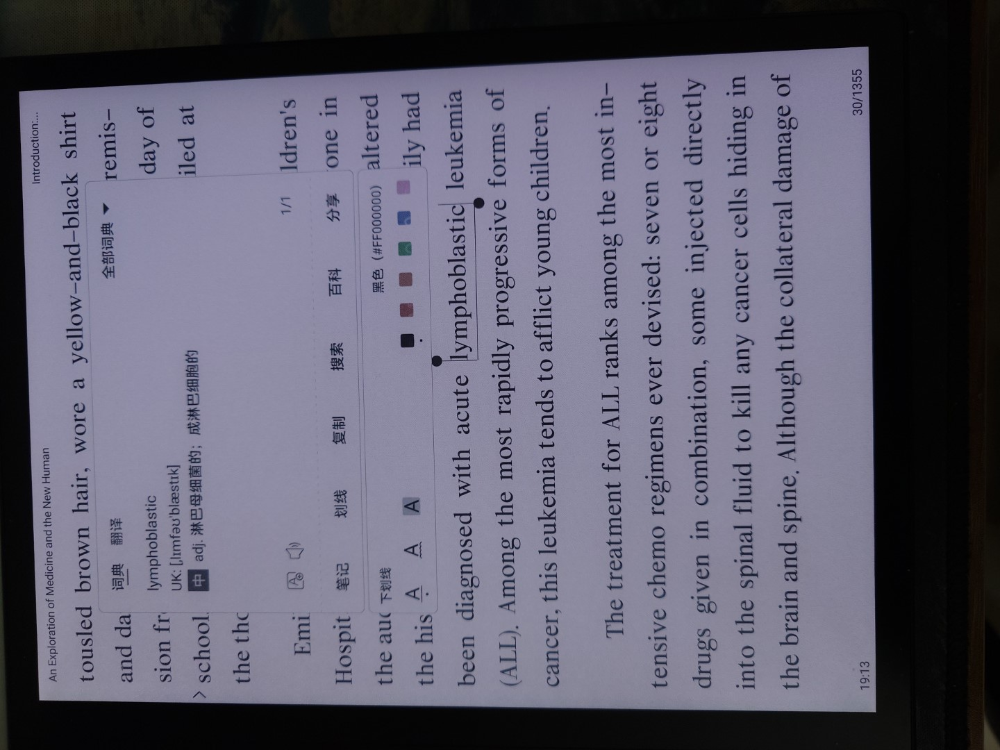
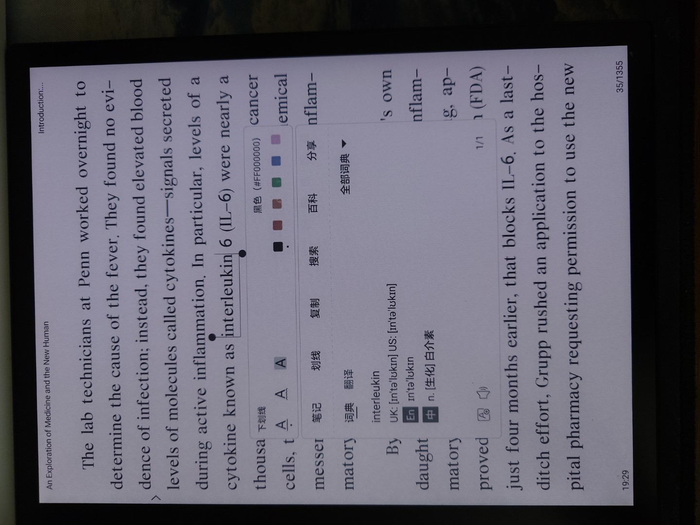
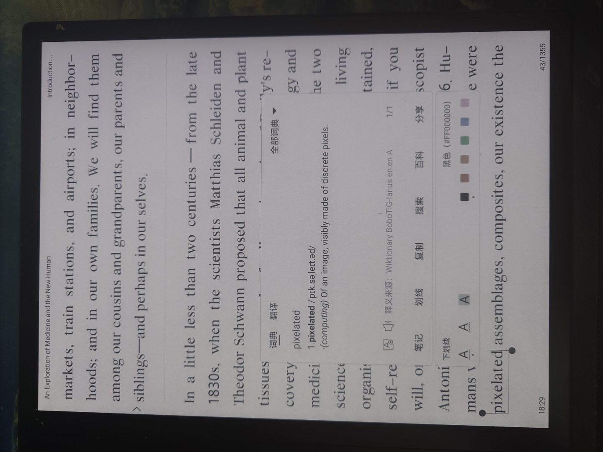
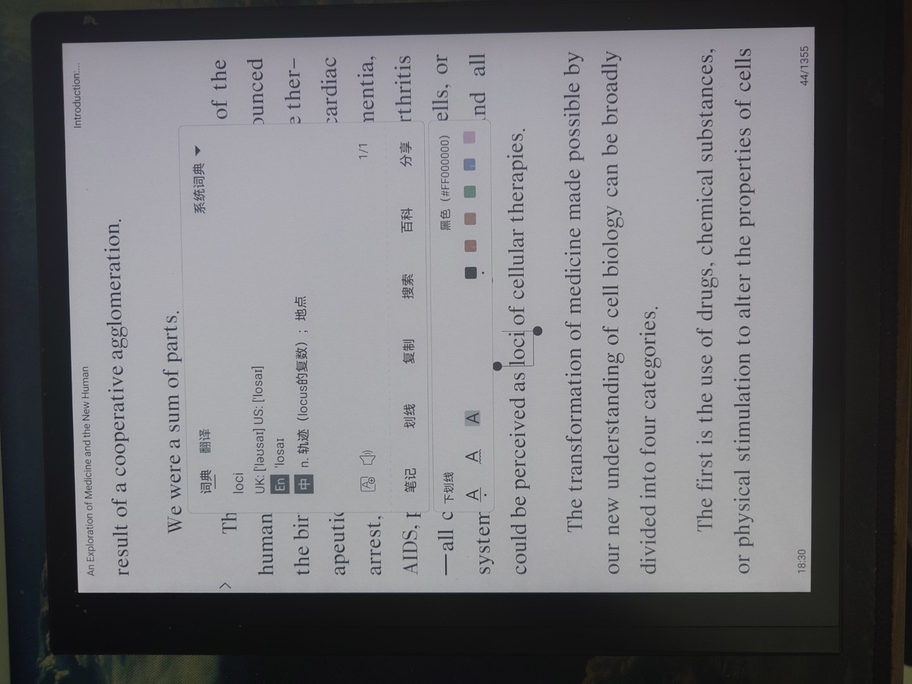
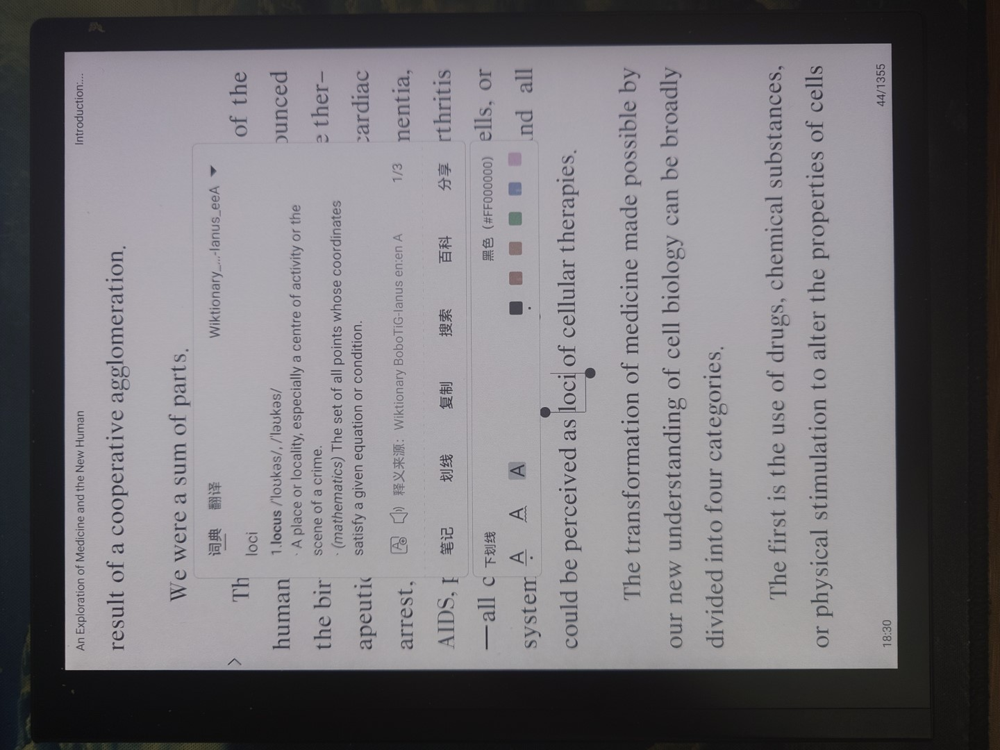
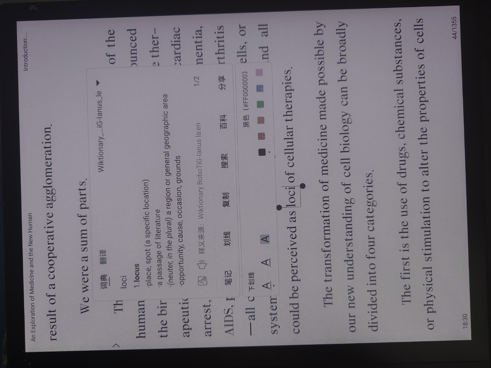
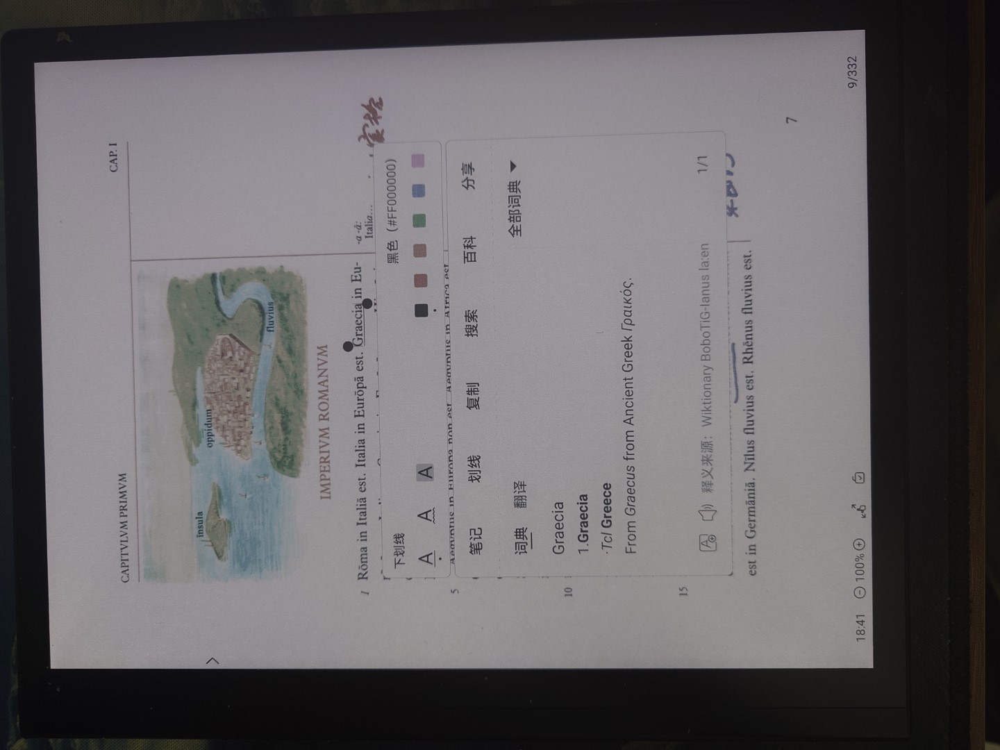
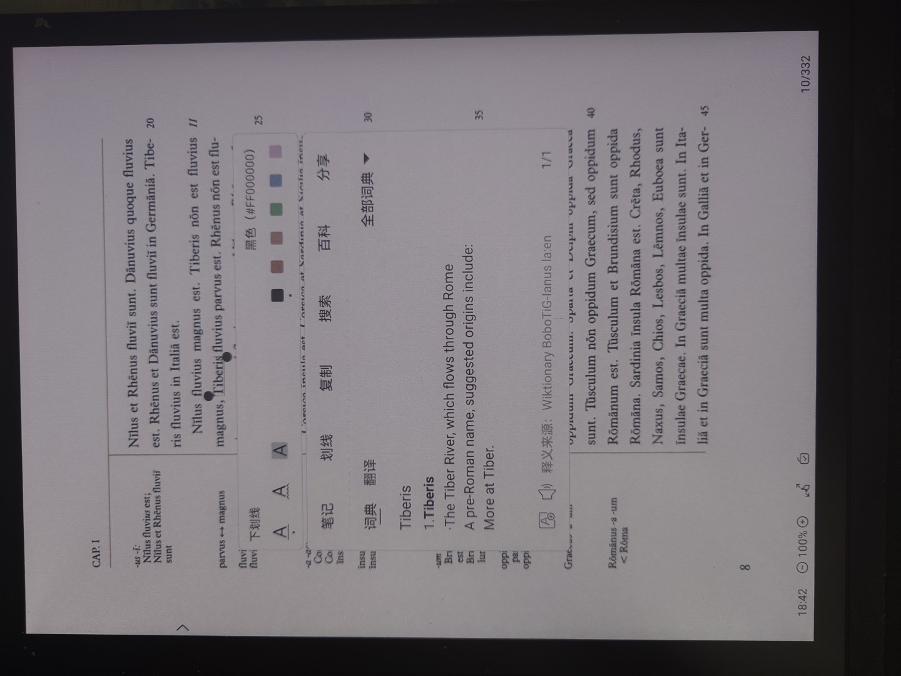
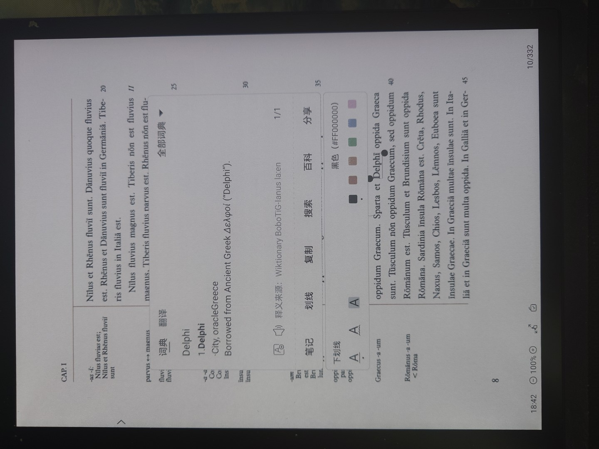

KOReader中的效果如下，设备从左到右分别是墨案迷你阅、掌阅Light4C、掌阅Smart5C。

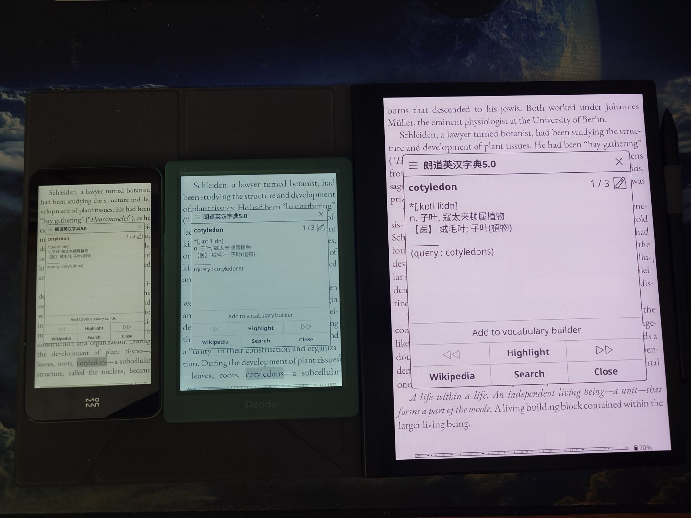
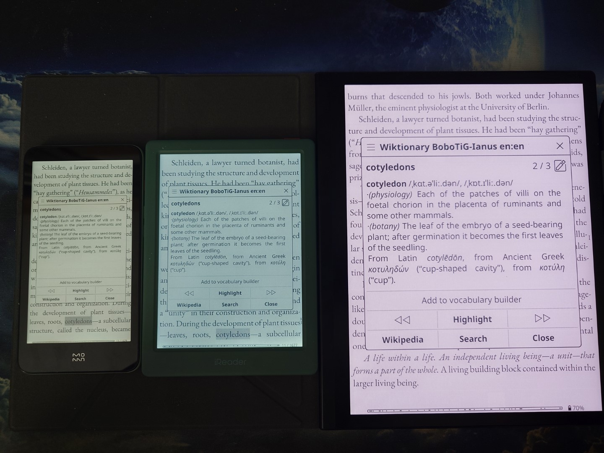
