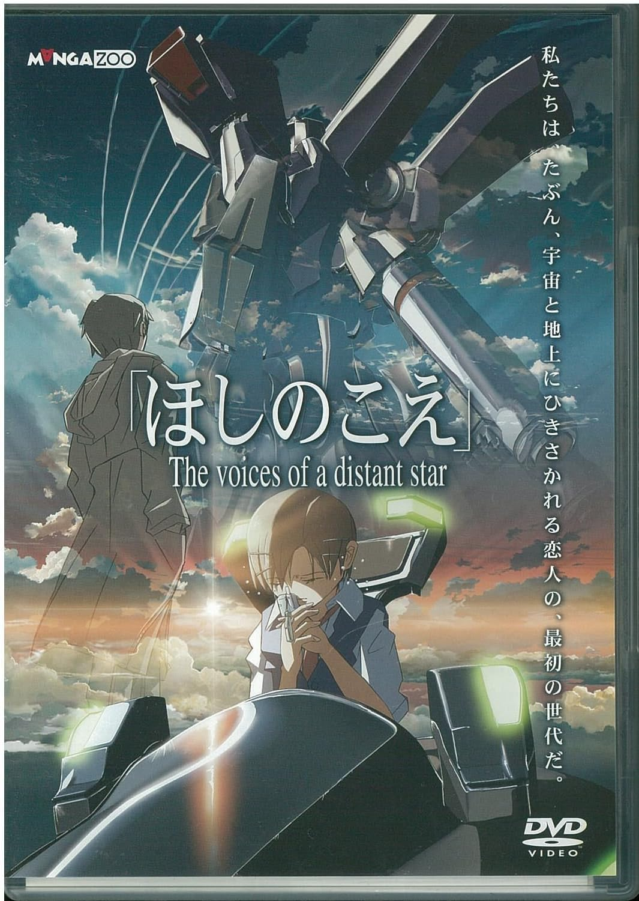

# 星之声是说的回避型依恋的故事？

Ianus Inferus

2026-01-01

新海诚的最初的动画《星之声》（ほしのこえ）以及小说讲述的是寺尾升和初中同学长峰美加子的故事。寺尾升和长峰美加子在初中的剑道部相识并互相产生好感，但在毕业之前长峰美加子被国联宇宙军选中为单人战斗机器人飞船驾驶员参加Tarsian外星人调查舰队前往天狼星α·β星系。两人通过手机短信聊天，但后期随着舰队的距离越来越远，发送短信所需要的时间也越来越远。

如果我们将故事背景的外星人去除，可以发现这其实是在讲两个回避型依恋之间的故事。两人在物理距离很近时，不敢表达爱意，而当物理距离越来越远时，反而越来越想念对方；寺尾升和高岛瑶子短暂的交往后，在确定长峰美加子生死的消息到来之前，下决心不再交往；在和外星人大战之时，两人不停地回味以前在一起时的事。

其实发送短信间隔如此之久，在现实的层面上是断联，将一种主动的行为讲述成了一个被动的行为。本质上讲的是多次断联又多次找回的回避型的恋爱。

如果大家有过类似的经历，必定会有一种很熟悉的感觉。
