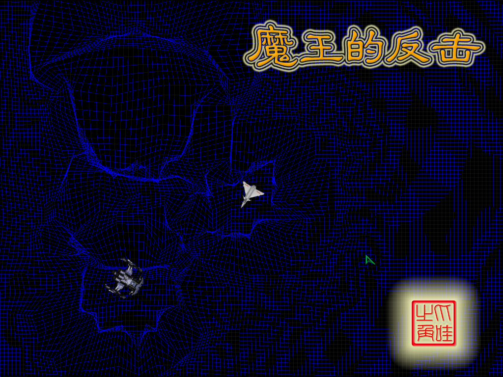

# 魔王的反击

爪哇之角小组

2008-07

一般的空战游戏都是你控制一架小型战斗机，通过战斗获得武器等级提升，然后于关卡中的BOSS战机进行战斗，BOSS通常都是行动模式单一，但火力强劲的家伙，换句话说就是四肢发达，头脑简单，闪避敌人的子弹是通常战机中的首要技巧。

本作品突破传统空战游戏，采用大逆转思路，将玩家与AI逆转，玩家在游戏中扮演普通空战中的BOSS机体，而你的对手则是一部（或多部）由AI控制的普通空战的小型机，和普通空战中玩家控制的小型机一样，火力很弱，但拥有超强的闪避能力。

主要特色：
玩家:
1)	玩家可以体验在一款空战游戏中，做BOSS的辛酸与喜悦，换种思考方式，换种娱乐方式。
2)	玩家也可以选择休闲模式来练练自己的躲避技术，本游戏的多人对战部分也别有一番风味。
游戏:
1)	成功实现逆转思想，让玩家充分体验BOSS感受。
2)	AI成功，和游戏紧密结合。
3)	画面显示流畅、清晰，且有大量非常绚丽的特效。 
4)	操作与一般空战不太一样，更符合太空战争的感觉。操作难度较大，稍微增强了游戏的紧张感，更利于玩家手脑开发。
5)	游戏联网方便流畅，具有相当高的同步率。

补充说明：

2009-02

键位：

    W     上
    A     左
    S     下
    D     右
    (以下仅在魔王模式下有效)
    空格 斥力
    Q     攻击武器
    R     更换攻击武器(冲击波、炸弹、激光)
    鼠标左键 跟踪子弹

可执行文件需要计算机上装有JRE 1.6 update 6或以上才可运行。
请到 http://java.sun.com/javase/downloads/index.jsp 下载最新的JRE。

本游戏按照BSD开源协议开源，见用户使用协议.txt。

源文件

[CAB.rar](CAB.rar)

可执行文件

[CAB.zip](CAB.zip)
